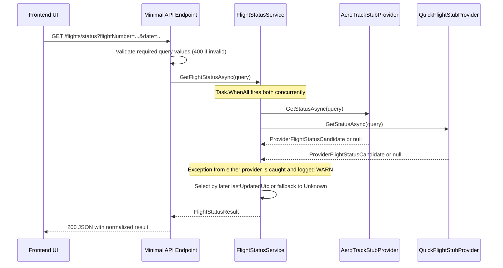

# Architecture - Flight Status Lookup

## 1. Architecture Style
Chosen style: Layered architecture.

Justification: This solution has a single read use case, no persistence, and two external provider adapters, so a simple layered structure is sufficient and avoids over-engineering.

## 2. Layers And Responsibilities

### 2.1 API Layer
- Responsibility: Receive HTTP requests, validate boundary inputs, call application service, and map service output to HTTP response.
- Contains: Minimal API endpoint definitions, request validation, error payload shaping.
- Dependency direction: API depends on Application abstractions only.

### 2.2 Application Layer
- Responsibility: Orchestrate provider calls, apply selection/fallback rules, and produce normalized result model.
- Contains: `IFlightStatusService` contract and `FlightStatusService` implementation.
- Dependency direction: Application depends on Domain contracts and provider abstractions.

### 2.3 Domain Layer
- Responsibility: Define stable business model and business rules contract for unified status behavior.
- Contains: Entities, enums, and abstraction contracts (`IFlightStatusProvider`, model types).
- Dependency direction: Domain has no dependency on API or Infrastructure.

### 2.4 Infrastructure Layer
- Responsibility: Implement external source adapters as deterministic stubs and normalize provider-specific data into domain candidate model.
- Contains: `AeroTrackStubProvider`, `QuickFlightStubProvider`, provider-specific raw model mapping.
- Dependency direction: Infrastructure depends on Domain abstractions only.

### 2.5 Dependency Direction Rule
All dependencies point inward:
API -> Application -> Domain
Infrastructure -> Domain

No layer may depend outward (Domain must not reference API, Application, or Infrastructure).

## 3. Design Patterns Used

### 3.1 Strategy
- Component: `IFlightStatusProvider` with two interchangeable implementations.
- Why it fits: Each provider has different schema and status vocabulary but fulfills the same contract.
- SOLID alignment: Open/Closed Principle, new providers can be added by adding another implementation without modifying endpoint code.

### 3.2 Adapter
- Component: Provider implementations that translate AeroTrack and QuickFlight raw responses into `ProviderFlightStatusCandidate`.
- Why it fits: External provider schemas differ and must be transformed into one internal shape.
- SOLID alignment: Single Responsibility Principle, each adapter only handles one provider mapping responsibility.

### 3.3 Dependency Injection
- Component: Endpoint receives `IFlightStatusService`; service receives `IEnumerable<IFlightStatusProvider>`.
- Why it fits: Swappable implementations and testability without concrete coupling.
- SOLID alignment: Dependency Inversion Principle, high-level logic depends on abstractions.

## 4. Patterns Deliberately Avoided
- Repository and Unit of Work: No persistence in scope.
- CQRS and Mediator: Single lightweight read use case; additional indirection is unnecessary.
- Factory: Runtime provider type construction is not needed because DI provides all provider instances.
- Event Sourcing: No audit or replay requirement in scope.

## 5. DI Registrations
Register the following in `Program.cs`:

```csharp
builder.Services.AddScoped<IFlightStatusService, FlightStatusService>();
builder.Services.AddScoped<IFlightStatusProvider, AeroTrackStubProvider>();
builder.Services.AddScoped<IFlightStatusProvider, QuickFlightStubProvider>();
```

Usage rule:
- Endpoint must consume only `IFlightStatusService`.
- Service must consume `IEnumerable<IFlightStatusProvider>`.
- Endpoint must not reference provider concrete classes.

## 6. Folder And File Layout

### 6.1 FlightStatus.Api

- `Program.cs`: Entry point, DI wiring, CORS, Swagger, endpoint mapping.
- `Contracts/ApiError.cs`: API error response contract.
- `Contracts/FlightStatusResponse.cs`: API response contract mirroring `FlightStatusResult`.
- `Domain/Enums/UnifiedFlightStatus.cs`: Unified status enum.
- `Domain/Models/FlightStatusQuery.cs`: Request model used by service and providers.
- `Domain/Models/FlightStatusResult.cs`: Final normalized business result model.
- `Domain/Models/ProviderFlightStatusCandidate.cs`: Intermediate normalized provider candidate model.
- `Domain/Abstractions/IFlightStatusProvider.cs`: Provider strategy contract.
- `Domain/Abstractions/IFlightStatusService.cs`: Application service contract.
- `Application/Services/FlightStatusService.cs`: Orchestration, selection, fallback, and logging.
- `Infrastructure/Providers/AeroTrack/AeroTrackRawResponse.cs`: AeroTrack raw stub schema.
- `Infrastructure/Providers/AeroTrack/AeroTrackStubProvider.cs`: AeroTrack deterministic stub and adapter mapping.
- `Infrastructure/Providers/QuickFlight/QuickFlightRawResponse.cs`: QuickFlight raw stub schema.
- `Infrastructure/Providers/QuickFlight/QuickFlightStubProvider.cs`: QuickFlight deterministic stub and adapter mapping.

### 6.2 FlightStatus.Tests

- `Unit/Application/FlightStatusServiceTests.cs`: Rule-driven unit tests for selection, fallback, and mapping.
- `Unit/Infrastructure/AeroTrackStubProviderTests.cs`: AeroTrack mapping and deterministic behavior tests.
- `Unit/Infrastructure/QuickFlightStubProviderTests.cs`: QuickFlight mapping and deterministic behavior tests.
- `Integration/FlightStatusEndpointTests.cs`: In-process endpoint tests for 200, 400, and Unknown outcomes.
- `TestDoubles/ThrowingProviderStub.cs`: Provider double that throws for resilience-path tests.

### 6.3 flight-status-ui

- `src/environments/environment.ts`: Production environment config (API base URL).
- `src/environments/environment.development.ts`: Development environment config overrides.
- `src/app/models/unified-flight-status.ts`: Frontend enum mirroring backend UnifiedFlightStatus values.
- `src/app/models/flight-status-result.ts`: Frontend interface mirroring FlightStatusResult response shape.
- `src/app/services/flight-status-api.service.ts`: HTTP service wrapping GET /flights/status; API base URL from environment.
- `src/app/components/search-form/search-form.component.ts`: Flight number + date input form with required validation and loading guard.
- `src/app/components/search-form/search-form.component.html`: Search form template.
- `src/app/components/search-form/search-form.component.scss`: Search form styles.
- `src/app/components/status-result/status-result.component.ts`: Result card with status color coding and conditional AeroTrack fields.
- `src/app/components/status-result/status-result.component.html`: Result card template.
- `src/app/components/status-result/status-result.component.scss`: Result card styles including color map.
- `src/app/app.ts`: Shell; owns isLoading/result/error state, wires form submission to HTTP service.
- `src/app/app.html`: Root template; hosts search-form and status-result.
- `src/app/app.config.ts`: App bootstrap config; registers HttpClient and FlightStatusApiService.

## 7. Request And Data Flow



## 8. Architecture Constraints
- Follow SOLID, DRY, KISS, and YAGNI.
- No dependency additions unless required by spec.
- Provider calls must be independent and failure-isolated.
- Input validation must stay at API boundary.
